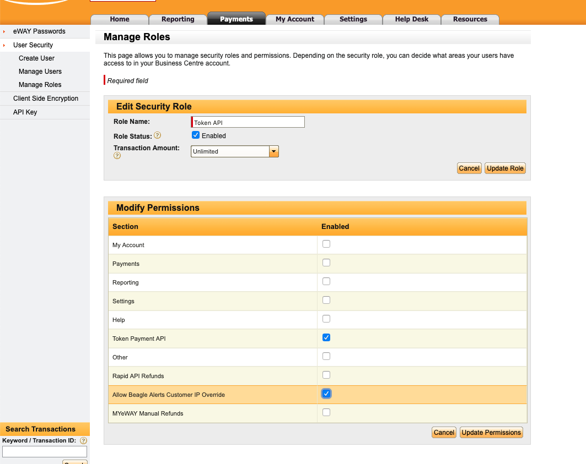
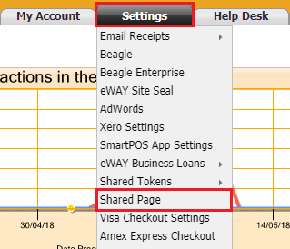
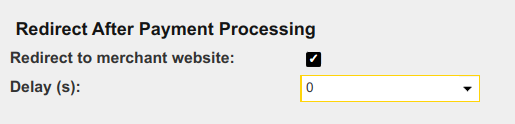

# eWay Recurring Payment Processor for CiviCRM

CiviCRM payment processor extension for [eWay](https://eway.com.au) which uses
the latest [eWay Rapid API](https://www.eway.com.au/features/api-rapid-api/) and
ensures [PCI DSS compliance](https://www.eway.com.au/about-eway/technology-security/pci-dss/). 

Supports both once-off and recurring payment utilising the secure token payment
method. This essential for automating the process setting up recurring donations
and memberships in your CiviCRM securely and reliably. This payment processor
also allows you to specify a particular day of the month to process all
recurring payments together.

You will need to have an [eWay account](https://eway.com.au) to use this payment
processor on your CiviCRM website.

## Installation

1. Download the [latest version of this
   extension](https://github.com/agileware/au.com.agileware.ewayrecurring/archive/master.zip)
2. Extract it to your CiviCRM extensions directory, as defined in "System
   Settings / Directories".
3. Go to "Administer / System Settings / Extensions" and enable the "eWay
   Recurring Payment Processor (au.com.agileware.ewayrecurring)" extension.

## Upgrade instructions

If you are changing from a different eWay Payment Processor or upgrading from eWay Recurring 1.x, please read the [Upgrade Instructions](UPGRADE.md)

## eWay API Key and Password

Configure the payment processor with the required eWay API Key and Password as
obtained from the [eWay Account](https://go.eway.io).
eWay provides [step by step instructions](https://go.eway.io/s/article/How-do-I-setup-my-Live-eWAY-API-Key-and-Password)
for generating these details.

## eWay Account Configuration

It is recommended to set the following options in the eWay account.

Log into **MYeWAY** and go to **My Account tab** > **User Security** > **Manage Roles**.
Click on the **Role** to get to the **Role Permissions**.

Enable the **Allow Beagle Alerts Customer IP Override** permission for the role assigned to the API account.
This is required for any CiviCRM site which is operating behind a proxy server such as Nginx, CloudFlare etc.

This can be indicated by eWay error response with text: _Function Not Permitted to Terminal_

## Recommended eWay Shared Page Settings

By default, when a credit card payment is processed by eWay, the transaction is not confirmed in CiviCRM until either:

1. the customer waits for the **default 5 seconds** before being returned to the website or 
2. the customer clicks the **Finalise Transaction** button.

It is often the case that neither of these events occur which results in the CiviCRM **Contribution** record being created with a **Status** of _Pending (Incomplete Transaction)_.

The responsibility of marking these Contributions as _Completed_ then becomes a **manual process** of reconciling the eWay payment with the Contribution record, which is not ideal.

To avoid this situation, it is recommended to change the **Redirect After Payment Processing** delay default from 5 seconds to **0 seconds**. Thereby reducing the likelihood of the transaction not being confirmed in CiviCRM and thus ensuring that the Contribution **Status** is set to _Completed_.

To change the **Redirect After Payment Processing** option:

1. Login to MYeWAY.
2. Hover the mouse over the Settings tab then click on Shared Page.
3. Locate the **Redirect After Payment Processing** option.
4. Change the option to **0 seconds**.

For more details see, [https://go.eway.io/s/article/Can-I-customize-the-eWAY-hosted-Payment-page?language=en_US](https://go.eway.io/s/article/Can-I-customize-the-eWAY-hosted-Payment-page?language=en_US)

Recommended setting for **Redirect After Payment Processing** is **0 seconds**.

## eWay Transactions Verification

The **eWay Transaction Verifications** job verifies the pending transactions in
eway. This is required for when CiviCRM is unable to verify the transaction
immediately, for example if the end user does not press the *Return to Merchant*
button or if the contribution was made via a Drupal Webform.

Visit `civicrm/admin/job` to enable **eWay Transaction Verifications** job.

## Failed eWay Transactions

Recurring contribution transactions could fail for one of several reasons; in
these situations, the extension will mark the recurring contribution as failed
and retry the transaction at an interval up to a maximum number of times, both
of which can be configured.

To update the **Maximum retries** and **Retry delay (in days)** go to
`civicrm/ewayrecurring/settings`. The default **Maximum retries** is 3
and **Retry delay** is 4 days.

You will be notified if there are any failed contributions that are no longer being retried via a
CiviCRM system status check.

## Reactivating Failed Contributions

This processor includes a Search kit action to Reactivate a failed Recurring Contribution.
The action is not currently available to the built-in Recurring Contribution list on the contact
card, however may be added to any Search kit on Recurring Contributions, for example the included
"Failed Recurring Contributions" listing.

This action will prompt you for an optional date to reset the next scheduled date to process the
recurring contribution, and then:

- Set the Number of Failures to 0,
- Clear the Retry Failed Attempt Date,
- Update the Next Scheduled Contribution Date as requested, and
- Reset the Recurring Contribution's status to in progress.

The contribution will then be processed as soon as the Next Scheduled Contribution Date has passed,
*which will most likely be the next processing run* if you do not explicitly set it to a future
date when prompted.

Using this action on Recurring Contributions with other payment processors is possible and will
update the recurring contribution status, however the behaviour depends on the payment processor
setup and a majority do not take the status in CiviCRM into account due to the payment being
processed automatically on the gateway.

## eWay Settlement Sync

The **eWay Settlement Sync** job reconciles the **Fee Amount** and **Net
Amount** on Completed contributions using eWay's [Settlement Reports
API](https://go.eway.io/s/article/Settlement-Reports-API-Snippets?language=en_US),
which returns daily summaries of settled transactions and the fees eWay
deducted from each one. This automates fee/net amount reconciliation that
would otherwise have to be done manually by cross-checking the MYeWAY portal.

By default this feature is **disabled** and does nothing. To enable it:

1. Go to `civicrm/ewayrecurring/settings` and select which **live** eWay
   payment processors the sync should cover, under **Settlement Sync:
   Payment Processors**. Leaving this empty disables the sync entirely -
   test/sandbox processors are never covered, as eWay's sandbox does not
   return settlement data.
2. Optionally adjust **Settlement Sync: Window (days)** (default: 10, valid
   range 1-90). This controls both how far back a Completed contribution is
   still treated as awaiting reconciliation, and how many days of eWay
   settlement reports are queried on each run. A contribution older than
   this window is left for standard manual reconciliation.
3. Visit `civicrm/admin/job` and enable the **eWay Settlement Sync** job
   (runs Daily by default).

The sync only ever updates a contribution's Fee Amount / Net Amount while
they are still unset (Fee Amount = 0), so it will not overwrite a fee that
has already been reconciled by some other means. You can also trigger a
sync for a single contribution manually via the API (for example from the
CiviCRM API Explorer, or `cv api3 EwaySettlement.Sync contribution_id=123`).

## CiviCRM template overrides

This extension applies changes to the following CiviCRM templates:

1. **CancelSubscription** - hides an option to send cancellation request, as all processing is done locally
2. **Amount** - adds a field to specify the day for recurring payment in the contribution page settings
3. **UpdateSubscription** - adds a field to change the next payment date

# About the Authors

This CiviCRM extension was developed by the team at
[Agileware](https://agileware.com.au).

[Agileware](https://agileware.com.au) provide a range of CiviCRM services
including:

  * CiviCRM migration
  * CiviCRM integration
  * CiviCRM extension development
  * CiviCRM support
  * CiviCRM hosting
  * CiviCRM remote training services

Support your Australian [CiviCRM](https://civicrm.org) developers, [contact
Agileware](https://agileware.com.au/contact) today!

