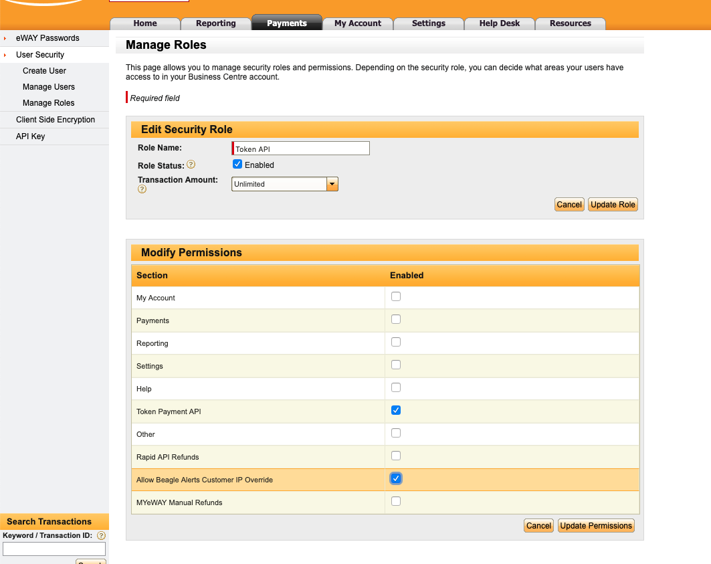
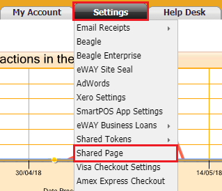

# eWay Recurring Payment Processor for CiviCRM

CiviCRM payment processor extension for [eWay](https://eway.com.au) which uses
the latest [eWay Rapid API](https://www.eway.com.au/features/api-rapid-api/) and
ensures [PCI DSS compliance](https://www.eway.com.au/about-eway/technology-security/pci-dss/). 

Supports both once-off and recurring payment utilising the secure token payment
method. This essential for automating the process setting up recurring donations
and memberships in your CiviCRM securely and reliably. This payment processor
also allows you to specify a particular day of the month to process all
recurring payments together.

You will need to have an [eWay account](https://eway.com.au) to use this payment
processor on your CiviCRM website.

## Installation

1. Download the [latest version of this
   extension](https://github.com/agileware/au.com.agileware.ewayrecurring/archive/master.zip)
2. Extract it to your CiviCRM extensions directory, as defined in "System
   Settings / Directories".
3. Go to "Administer / System Settings / Extensions" and enable the "eWay
   Recurring Payment Processor (au.com.agileware.ewayrecurring)" extension.

## Upgrade instructions

If you are changing from a different eWay Payment Processor, please read the [Upgrade Instructions](UPGRADE.md)

If you are upgrading from eWay Recurring 1.x, please read the [Upgrade Instructions](UPGRADE.md)

## eWay API Key and Password

Configure the payment processor with the required eWay API Key and Password as
obtained from the [eWay Account](https://go.eway.io).
eWay provides [step by step instructions](https://go.eway.io/s/article/How-do-I-setup-my-Live-eWAY-API-Key-and-Password)
for generating these details.

## eWay Account Configuration

It is recommended to set the following options in the eWay account.

Log into **MYeWAY** and go to **My Account tab** > **User Security** > **Manage Roles**.
Click on the **Role** to get to the **Role Permissions**.

Enable the **Allow Beagle Alerts Customer IP Override** permission for the role assigned to the API account.
This is required for any CiviCRM site which is operating behind a proxy server such as Nginx, CloudFlare etc.

This can be indicated by eWay error response with text: _Function Not Permitted to Terminal_

## Recommended eWay Shared Page Settings

By default, when a credit card payment is processed by eWay, the transaction is not confirmed in CiviCRM until either:

1. the customer waits for the **default 5 seconds** before being returned to the website or 
2. the customer clicks the **Finalise Transaction** button.

It is often the case that neither of these events occur which results in the CiviCRM **Contribution** record being created with a **Status** of _Pending (Incomplete Transaction)_.

The responsibility of marking these Contributions as _Completed_ then becomes a **manual process** of reconciling the eWay payment with the Contribution record, which is not ideal.

To avoid this situation, it is recommended to change the **Redirect After Payment Processing** delay default from 5 seconds to **0 seconds**. Thereby reducing the likelihood of the transaction not being confirmed in CiviCRM and thus ensuring that the Contribution **Status** is set to _Completed_.

To change the **Redirect After Payment Processing** option:

1. Login to MYeWAY.
2. Hover the mouse over the Settings tab then click on Shared Page.
3. Locate the **Redirect After Payment Processing** option.
4. Change the option to **0 seconds**.

For more details see, https://go.eway.io/s/article/Can-I-customize-the-eWAY-hosted-Payment-page?language=en_US

## eWay Transactions Verification

The **eWay Transaction Verifications** job verifies the pending transactions in
eway. This is required for when CiviCRM is unable to verify the transaction
immediately, for example if the end user does not press the *Return to Merchant*
button or if the contribution was made via a Drupal Webform.

Visit `civicrm/admin/job` to enable **eWay Transaction Verifications** job.

## Failed eWay Transactions

Recurring contribution transactions could fail for one of several reasons; in
these situations, the extension will mark the recurring contribution as failed
and retry the transaction at an interval up to a maximum number of times, both
of which can be configured.

To update the **Maximum retries** and **Retry delay (in days)** go to
`civicrm/ewayrecurring/settings`. The default **Maximum retries** is 3
and **Retry delay** is 4 days.

## CiviCRM template overrides

This extension applies changes to the following CiviCRM templates:

1. **CancelSubscription** - hides an option to send cancellation request, as all processing is done locally
2. **Amount** - adds a field to specify the day for recurring payment in the contribution page settings
3. **UpdateSubscription** - adds a field to change the next payment date

# About the Authors

This CiviCRM extension was developed by the team at
[Agileware](https://agileware.com.au).

[Agileware](https://agileware.com.au) provide a range of CiviCRM services
including:

  * CiviCRM migration
  * CiviCRM integration
  * CiviCRM extension development
  * CiviCRM support
  * CiviCRM hosting
  * CiviCRM remote training services

Support your Australian [CiviCRM](https://civicrm.org) developers, [contact
Agileware](https://agileware.com.au/contact) today!

